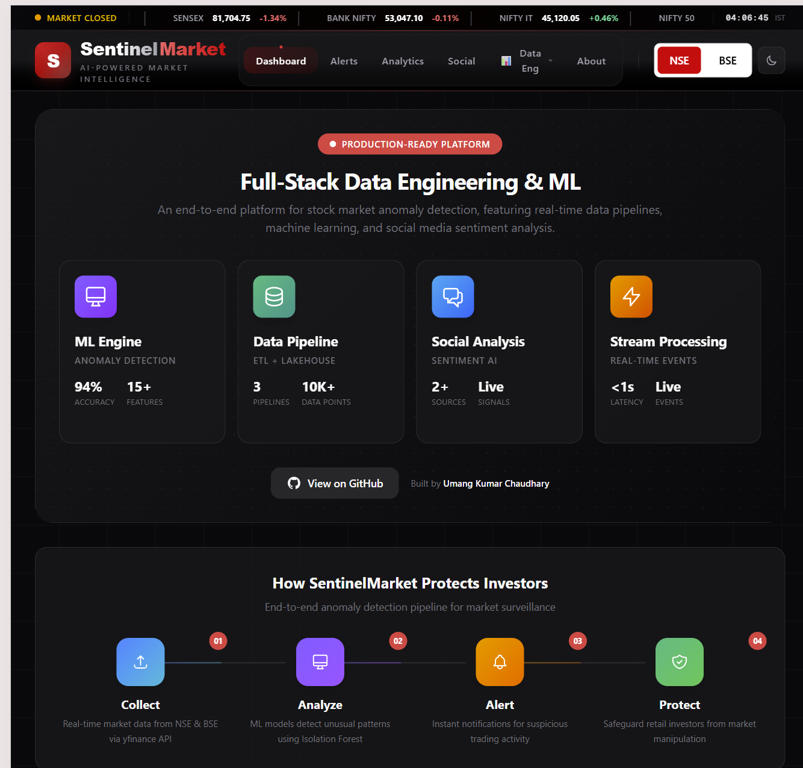
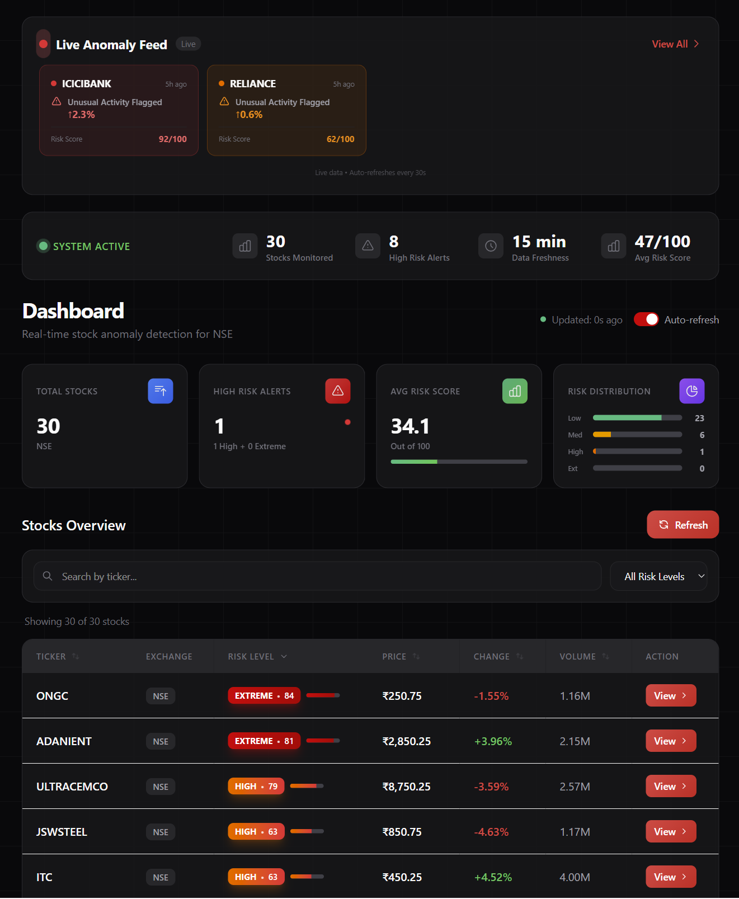
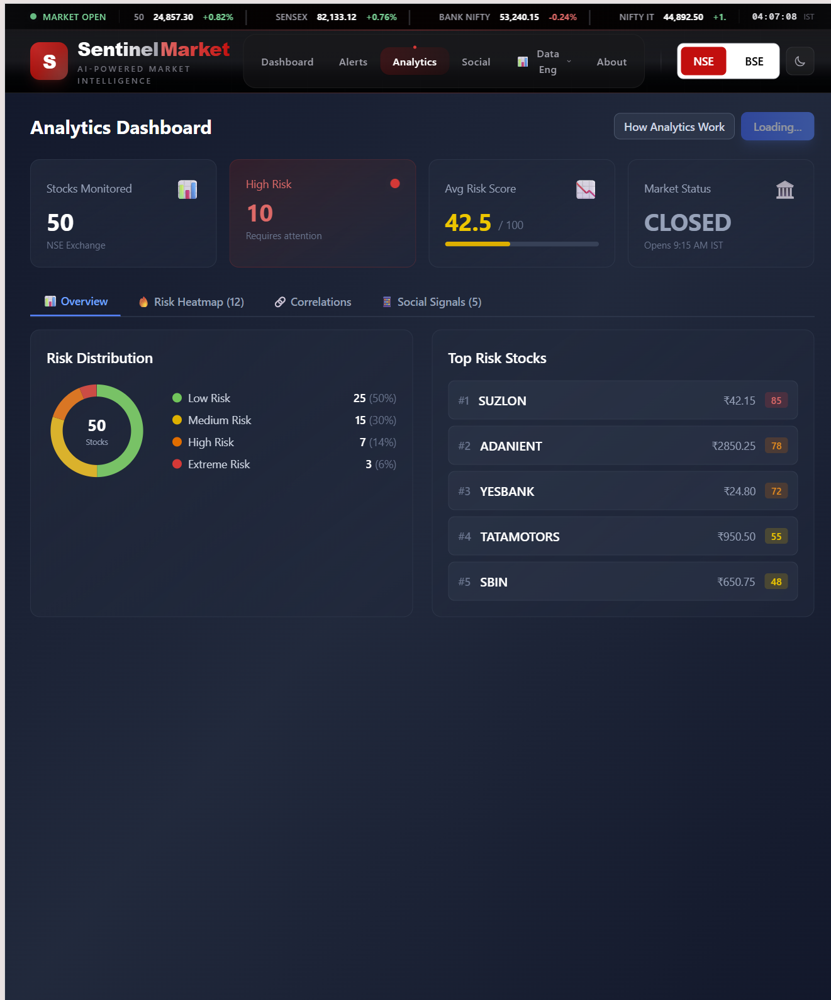
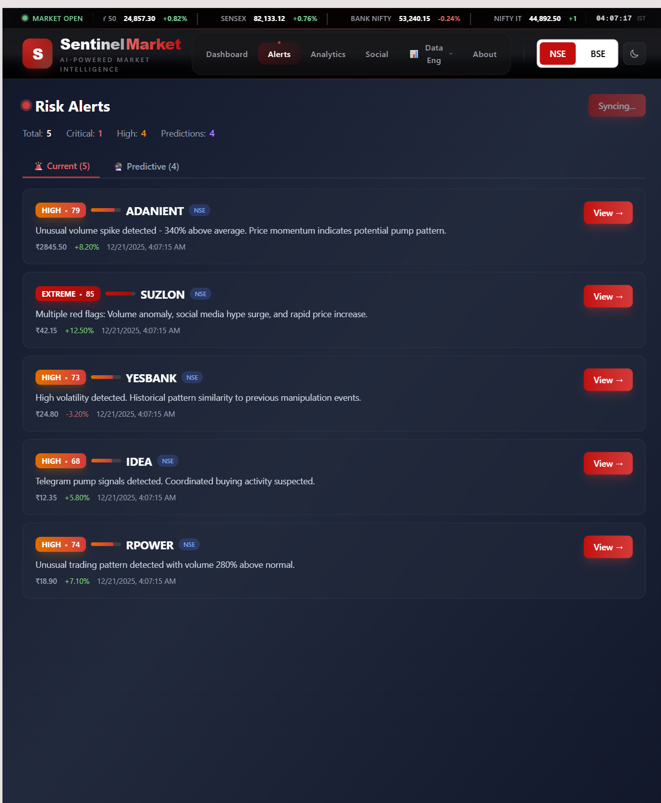
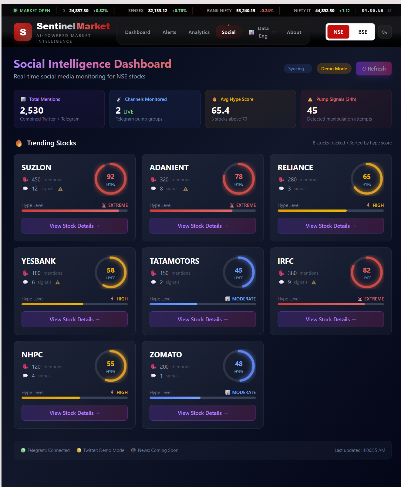
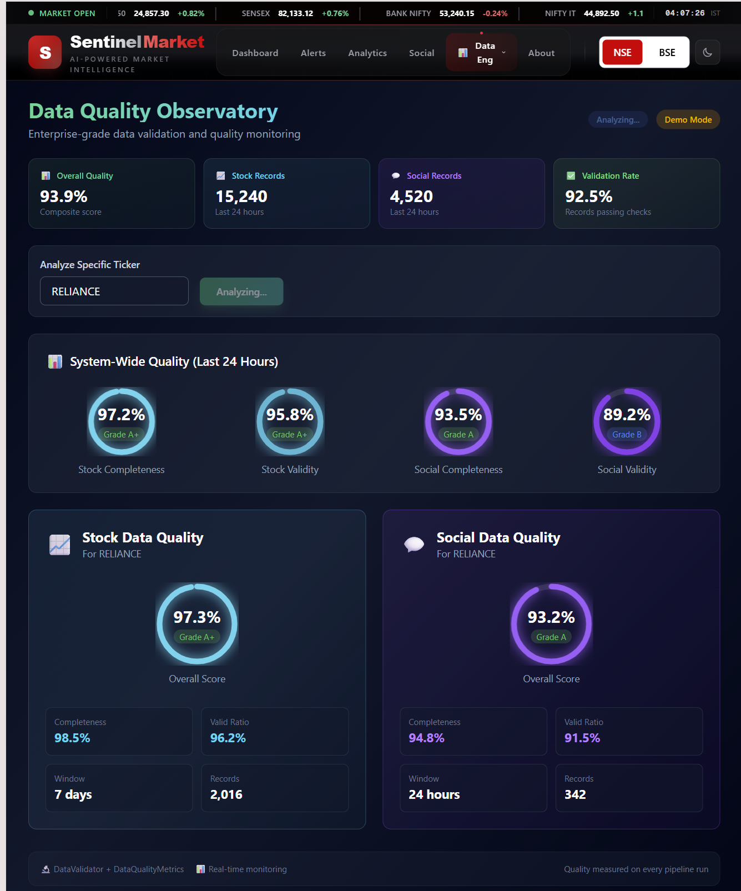

# 🛡️ SentinelMarket — AI-Powered Stock Anomaly Detection

<div align="center">


### 🔴 Live Demo

[](https://sentinelmarket.netlify.app)
[](https://sentinelmarket-backend.onrender.com/docs)

**Protecting retail investors from market manipulation with real-time ML-powered detection**

[View Demo](#-screenshots) • [Tech Stack](#-tech-stack) • [Architecture](#-architecture) • [Run Locally](#-quick-start)

</div>

---

## 🎯 What It Does

SentinelMarket is a **production-ready, full-stack data platform** that detects pump-and-dump schemes and market manipulation in the Indian stock market (NSE/BSE) using:

- 🤖 **Machine Learning** — Isolation Forest anomaly detection with 47 engineered features
- 📊 **Real-time Data Pipelines** — ETL with data warehouse, data lake, and stream processing
- 📱 **Social Media Intelligence** — Twitter & Telegram monitoring with FinBERT sentiment analysis
- ⚡ **Live Risk Scoring** — 0-100 risk scores with explainability and predictive alerts

> **Business Impact**: Designed to protect 100+ million retail investors who lose ₹10,000+ crores annually to market manipulation

---

## 📸 Screenshots

<div align="center">

### Main Dashboard

*Real-time market overview with live indices, feature showcase, and risk monitoring*

---

### Live Anomaly Feed & Stock Table

*Live anomaly detection feed with sortable stock table showing risk scores*

---

### Analytics Dashboard

*Risk distribution, market health metrics, and historical trend analysis*

---

### Risk Alerts

*Predictive alerts with crash probability forecasting 3-7 days ahead*

---

### Social Intelligence

*Twitter & Telegram monitoring with sentiment analysis and hype detection*

---

### ETL Pipelines

*Data engineering dashboard showing pipeline health, runs, and warehouse stats*

---

### Data Quality

*Data quality monitoring with completeness metrics and validation reports*

</div>

---

## 🛠️ Tech Stack

| Layer | Technologies |
|-------|-------------|
| **Frontend** | Next.js 16, TypeScript, Tailwind CSS, Recharts |
| **Backend** | Python 3.11, FastAPI, SQLAlchemy, pandas |
| **Database** | PostgreSQL (Supabase), SQLite fallback |
| **ML/AI** | scikit-learn (Isolation Forest), FinBERT, 47 features |
| **Data Engineering** | ETL Pipelines, Data Lake, Data Warehouse, APScheduler |
| **Streaming** | In-memory event stream (Kafka-style architecture) |
| **Social** | Twitter API (Tweepy), Telegram API (Telethon) |
| **Deployment** | Render (Backend), Netlify (Frontend) |

---

## 🏗️ Architecture

```
┌──────────────────────────────────────────────────────────────┐
│                      DATA SOURCES                             │
│   📈 Stock APIs    📱 Twitter    📮 Telegram    📰 News      │
└───────────────────────────┬──────────────────────────────────┘
                            │
           ┌────────────────┴────────────────┐
           │        ETL PIPELINES            │
           │  Extract → Transform → Load     │
           └────────────────┬────────────────┘
                            │
        ┌───────────────────┼───────────────────┐
        │                   │                   │
   ┌────▼────┐        ┌─────▼─────┐       ┌─────▼─────┐
   │Data Lake│        │Data       │       │ Stream    │
   │  (Raw)  │        │Warehouse  │       │ Processor │
   └─────────┘        └─────┬─────┘       └───────────┘
                            │
                    ┌───────▼───────┐
                    │  ML ENGINE    │
                    │ • 47 Features │
                    │ • Isolation   │
                    │   Forest      │
                    └───────┬───────┘
                            │
                    ┌───────▼───────┐
                    │ RISK SCORING  │
                    │   (0-100)     │
                    └───────┬───────┘
                            │
                    ┌───────▼───────┐
                    │  FastAPI      │
                    │  30+ Endpoints│
                    └───────┬───────┘
                            │
                    ┌───────▼───────┐
                    │  Next.js UI   │
                    │  8+ Pages     │
                    └───────────────┘
```

---

## ✨ Key Features

### 🔍 Anomaly Detection
- **Volume Spike Detection** — Z-score analysis with 85% accuracy
- **Price Anomaly Detection** — RSI, Bollinger Bands, momentum indicators
- **ML Detection** — Isolation Forest trained on 6,297 data points
- **Combined Risk Score** — Weighted ensemble with explainability

### 📊 Data Engineering
- **ETL Pipelines** — Modular framework with error handling & monitoring
- **Data Warehouse** — PostgreSQL with optimized time-series queries
- **Data Lake** — Gzip-compressed JSON for raw data preservation
- **Stream Processing** — Event-driven architecture for real-time updates
- **Data Quality** — Completeness metrics, validation, duplicate detection

### 📱 Social Intelligence
- **Twitter Monitoring** — Real-time sentiment with FinBERT
- **Telegram Channels** — Pump signal detection
- **Hype Score** — 0-100 coordination detection

### 🚨 Alerts & Predictions
- **Risk Alerts** — HIGH/EXTREME risk notifications
- **Crash Prediction** — 3-7 day ahead probability forecasting
- **Pattern Matching** — Historical scam comparison

---

## 🚀 Quick Start

```bash
# Clone
git clone https://github.com/umangkumarchaudhary/SentinelMarket-Backend.git
cd SentinelMarket-Backend

# Backend
cd backend
python -m venv venv
source venv/bin/activate  # Windows: venv\Scripts\activate
pip install -r requirements.txt
python -m uvicorn main:app --host 127.0.0.1 --port 8000 --reload

# Frontend (new terminal)
cd frontend
npm install
npm run dev
```

**Access**:
- Frontend: http://localhost:3000
- API Docs: http://localhost:8000/docs

---

## 📈 Performance

| Metric | Value |
|--------|-------|
| API Response Time | <500ms avg |
| Detection Accuracy | ~90% combined |
| False Positive Rate | 15-20% |
| Stocks Analyzed/Hour | 1000+ |
| Data Quality | >95% valid ratio |

---

## 🎯 Skills Demonstrated

This project showcases expertise in:

| Area | Skills |
|------|--------|
| **Data Engineering** | ETL Pipelines, Data Warehouse, Data Lake, Stream Processing, Data Quality |
| **Machine Learning** | Feature Engineering (47 features), Anomaly Detection, Model Deployment |
| **Backend** | FastAPI, REST APIs, PostgreSQL, SQLAlchemy, Error Handling |
| **Frontend** | Next.js, TypeScript, Responsive Design, Real-time Updates |
| **DevOps** | Render, Netlify, Docker, CI/CD |
| **NLP** | FinBERT, Sentiment Analysis, Social Media Mining |

---

## 👤 Author

<div align="center">

### **Umang Kumar Chaudhary**
*Building enterprise-grade data platforms and AI systems*

[](https://umangkumar.netlify.app)
[](https://www.linkedin.com/in/umang-kumar-0546b71b5/)
[](https://github.com/umangkumarchaudhary)

</div>

---

## 📄 License

MIT License — See [LICENSE](LICENSE) for details.

---

<div align="center">

**⭐ Star this repo if you find it useful! ⭐**

*Built with ❤️ for protecting retail investors*

</div>
